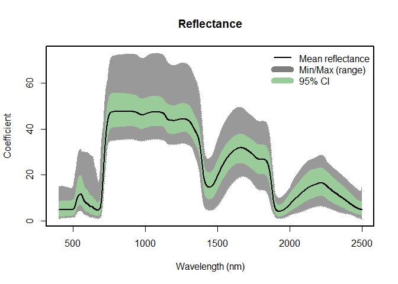

## 

The PLSR models generated using the GSTI database are located here:
<https://github.com/plantphys/gsti/tree/main/PLSR>

Each file with the “.Rdata” extension corresponds to a PLSR model
associated with the variable Vcmax25, Jmax25, TPU25, and Rdark25.

First, we need to load required libraries.

    library(here)  ## Used to identify the project repository
    library(pls) ## Used to build and use the plsr models

Then, we load the PLSR models. For this example, I only load the Vcmax25
PLSR model.

    path = here() ## Identify project repository
    setwd(file.path(path,'/PLSR'))
    load(file = "PLSR_model_Vcmax25.Rdata", verbose = TRUE) 

    ## Loading objects:
    ##   plsr_model
    ##   training
    ##   validation

Three objects are loaded into the environment: “plsr\_model”,
“training”, and “validation”. The “plsr\_model” object is the actual
PLSR model for the Vcmax25 variable, whereas “training” and “validation”
correspond to subsets of the GSTI database. The subset “training” was
used to calibrate the PLSR model while the subset validation was used to
validate the model on independent observations (20 % of observations not
used to train the model.).

The plsr\_model object is a list with several elements.
*n**c**o**m**p**i**s**t**h**e**n**u**m**b**e**r**o**f**c**o**m**p**o**n**e**n**t*(*l**a**t**e**n**t**v**a**r**i**a**b**l**e**s*)*t**h**a**t**w**e**r**e**u**s**e**d**t**o**b**u**i**l**d**t**h**e**m**o**d**e**l*coef
is a matrix with 1000 sets of coefficients corresponding to 1000 PLSR
models for Vcmax25. The matrix has 2102 columns, the first column
corresponds to the intercept of the 1000 PLSR models, and the columns 2
to 2102 correspond to the coefficients of the model associated to the
reflectance wavelengths 400 to 2500 nm.

Lets first look at the coefficients:

    intercepts <- plsr_model$coefs[1,]
    coefs <- plsr_model$coefs[2:2102,]  ## We only use the 2:2102 lines to exclude the intercept from the calculations
    mean_spec <- rowMeans(coefs) ## Mean of the coefficients.  
    coef_quantiles <- apply(coefs,1,quantile,na.rm=T,probs=c(0,0.01,0.025,0.05,0.5,0.95,0.975,0.99,1))

    wv <- 400:2500 ## Wavelengths of the PLSR model

    plot(x=NULL,y=NULL,xlim=c(400,2500),ylim=c(min(coefs),max(coefs)),xlab="Wavelength (nm)",
         ylab="Coefficient",main="Coefficients of the PLSR model")
    polygon(c(wv ,rev(wv)),c(coef_quantiles[9,], rev(coef_quantiles[1,])),
            col="grey60",border=NA)
    polygon(c(wv ,rev(wv)),c(coef_quantiles[6,], rev(coef_quantiles[4,])),
            col="#99CC99",border=NA)
    lines(wv,mean_spec,lwd=2, lty=1, col="black")
    lines(wv,coef_quantiles[1,], lty=3, col="grey60")
    lines(wv,coef_quantiles[9,], lty=3, col="grey60")
    legend("top",legend=c("Mean coefficients","Min/Max (range)", "95% CI"),lty=c(1,1,1),
           lwd=c(2,10,10),col=c("black","grey50","#99CC99"),bty="n")
    box(lwd=2.2)

For this example, we will predict the Vcmax25 values for the leaf
reflectance included in the validation dataset. Other datasets could be
used depending on your application. Note that the Reflectance matrix
needs to have Reflectance in % (0 - 100) organised in rows, with
reflectance values in the wavelength 400 to 2500 nm at a 1 nm interval.

    Reflectance <- unclass(validation$Spectra)

    mean_spec <- colMeans(Reflectance) ## Mean of the coefficients.  
    coef_quantiles <- apply(Reflectance,2,quantile,na.rm=T,probs=c(0,0.01,0.025,0.05,0.5,0.95,0.975,0.99,1))

    wv <- 400:2500 ## Wavelengths of the PLSR model

    plot(x=NULL,y=NULL,xlim=c(400,2500),ylim=c(min(Reflectance),max(Reflectance)),xlab="Wavelength (nm)",
         ylab="Coefficient",main="Reflectance")
    polygon(c(wv ,rev(wv)),c(coef_quantiles[9,], rev(coef_quantiles[1,])),
            col="grey60",border=NA)
    polygon(c(wv ,rev(wv)),c(coef_quantiles[6,], rev(coef_quantiles[4,])),
            col="#99CC99",border=NA)
    lines(wv,mean_spec,lwd=2, lty=1, col="black")
    lines(wv,coef_quantiles[1,], lty=3, col="grey60")
    lines(wv,coef_quantiles[9,], lty=3, col="grey60")
    legend("topright",legend=c("Mean reflectance","Min/Max (range)", "95% CI"),lty=c(1,1,1),
           lwd=c(2,10,10),col=c("black","grey50","#99CC99"),bty="n")
    box(lwd=2.2)

To calculate Vcmax25 we sum the intercepts of the PLSR models and the
coefficients time the reflectance. Since 1000 PLSR models were
generated, we obtain 1000 predictions tha twe can use to compute
confidence interval for the prediction. Of importance, the PLSR model
were built using Vcmax25 previously transformed using a squared root to
improve its ditribution. We therefore need to untransform the prediction
to obtain Vcmax25.

    prediction <- intercepts + Reflectance%*%coefs ## prediction = intercept + coef_400nm * wavelength_400nm + coef_401nm * wavelength_401nm + ... + coef_2500nm * wavelength_2500 nm, or in matrix notation Prediction = intercept + Coefs * Reflectancte 
    Vcmax25 <-  prediction^2 ## Vcmax25 was square root transformed to build the plsr model, and needs to be transformed back 
    Mean_Vcmax25 <- rowMeans(Vcmax25) ## Average Vcma25 predicted by the 1000 PLSR models
    lower_ci <- apply(X = Vcmax25, MARGIN = 1, FUN = quantile, probs = 0.025) ## Lower confidence interval (2.5 %)
    upper_ci <- apply(X = Vcmax25, MARGIN = 1, FUN = quantile, probs = 0.975) ## Upper confidence interval (97.5 %)

    plot(x = validation$Vcmax25, y = Mean_Vcmax25, xlab = "Observed Vcmax25", ylab = "PLSR prediction", pch = 16, xlim = c(0, max(Mean_Vcmax25,validation$Vcmax25)), ylim = c(0, max(Mean_Vcmax25,validation$Vcmax25)), cex = 0.5)

    arrows(x0 = validation$Vcmax25, 
           y0 = lower_ci, 
           y1 = upper_ci, 
           angle = 90, 
           code = 3, 
           length = 0.01,
           col = "grey") ## Adding the confidence interval

    ## Adding back the points so they are not overplot by the con
    points(x = validation$Vcmax25, y = Mean_Vcmax25, pch = 16, cex = 0.5)

    abline(c(0,1))

